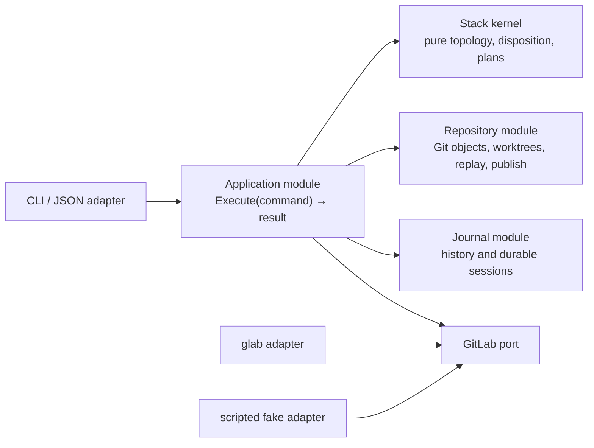

# mrstack v1 design

## Purpose

`mrstack` makes an ordinary linear chain of GitLab merge requests behave like a manageable stack on Agoda's GitLab 18.11 instance:

```text
default branch <- MR 1 branch <- MR 2 branch <- ... <- MR 10 branch
```

It discovers the chain from GitLab, checks structural and CI health, keeps a local observational history, and safely restacks dependent branches. An external coding agent can repeatedly call the versioned machine interface, resolve conflicts or CI failures, and continue the same loop.

Graphite's restack workflow is the conceptual precedent, but `mrstack` keeps no authoritative stack metadata: GitLab relationships remain reconstructible by any local invocation.

GitLab 19.1 native stacks reduce the visualization and retargeting work, but do not remove the need to replay layers onto updated predecessors, preserve resumable conflict state, expose bounded CI evidence, or provide a deterministic agent protocol.

## V1 boundary

V1 includes:

- zero-setup discovery of one strict same-project chain containing one to ten open MRs;
- one-shot health checks for topology, alignment, GitLab conflict state, and current-snapshot CI;
- a per-user SQLite journal shared by the user's local agents and worktrees;
- exact-layer restacking of the smallest affected suffix;
- full-stack restacking when the default branch moves;
- conflict, empty-commit, crash, and post-merge recovery;
- atomic leased publication of every rewritten branch;
- legacy post-merge retargeting and native GitLab 19.1-aware behavior;
- human-readable output and a versioned JSON agent interface.

V1 does not:

- create, split, reorder, approve, or merge MRs;
- infer a graph, support forks, or span projects;
- run a daemon or launch a coding agent;
- silently choose layer boundaries, conflict resolutions, empty-commit outcomes, or signature loss;
- treat the journal as stack membership authority;
- promise that `ready` means GitLab will permit a merge.

## Source of truth

GitLab MR source and target relationships are the sole authority for live membership and order. For adjacent members `A` then `B`:

```text
B.target_branch == A.source_branch
```

The front MR must logically terminate at the project's current GitLab default branch. In legacy mode only, an open successor may still name the absent source branch of a uniquely identified merged predecessor. That relationship remains GitLab lifecycle evidence, not a live branch: the predecessor's strategy-specific integration revision must be reachable from the captured base, and the successor's historical target head must be resolved exactly from GitLab MR/diff refs or previously bound journal evidence. Every other absent source or target branch is `invalid/missing_active_branch`.

The local journal may select a previously observed stack for historical verification, preserve exact evidence, and recover an operation. It may never add, remove, reorder, or reconnect live members.

Discovery queries opened, closed, and merged MRs when following a branch relationship so it can distinguish a merged predecessor, closed member, missing edge, and out-of-order merge. Only opened MRs belong to the active stack; non-open MRs are lifecycle evidence governed by ADR-0033 and ADR-0034.

## Operating modes

`doctor` reads `glab api version` and defaults to:

- `legacy` below GitLab 19.1: `mrstack` derives relationships and performs post-merge successor retargeting;
- `native` at GitLab 19.1 or later: GitLab owns stack visualization and automatic retargeting, while `mrstack` still derives the chain needed by its checks and restack engine.

If the version is unavailable, the caller must pass global `--gitlab-mode legacy|native`. When the server version is readable, an explicit mode is accepted only when it agrees with the detected mode; a contradictory override fails as invalid input rather than risking a legacy retarget race or skipping required legacy advancement. Both modes enforce the same v1 invariants and maximum depth.

In native mode, a successor that still targets a uniquely merged predecessor is `waiting/native_retarget_pending`. `mrstack` does not race GitLab with a manual update; the external agent controls retry duration and escalates a persistent GitLab failure to the user.

## Project and transport resolution

Every command runs inside a clone or worktree. `glab` is the only GitLab API transport: structured `glab` commands are used when sufficient and `glab api` supplies exact REST or GraphQL fields. Human-formatted `glab` output is never parsed.

The current branch's upstream remote is accepted only when it resolves to the authenticated GitLab project. Otherwise `--remote <name>` is required. Observation validates its fetch URL; mutation additionally requires its effective push URL to resolve to the same project. A triangular or ambiguous mutation remote fails before worktree creation. The snapshot records the selected name plus credential-free canonical fetch and push identities, every mutation action repeats that name with `--remote`, and all three values are revalidated before replay and publication.

## Implementation modules and seams

The CLI is an adapter over one deep application module. Its external interface accepts a typed command plus cancellation context and returns the same typed result later rendered as human text or the agent envelope. CLI parsing, subprocess output, REST shapes, SQL rows, and Git sequencer files do not leak through that interface.



The modules are:

- **Application module** — owns command orchestration, snapshot revalidation order, cancellation, and the public command outcome. Its small interface is the primary CLI and end-to-end test surface.
- **Stack kernel** — an in-process module that derives a strict chain, classifies lifecycle/alignment/CI observations, computes the affected suffix, validates exact layers, and advances the pure session state machine. It performs no I/O.
- **GitLab port** — a seam expressed in domain queries and guarded updates, not a mirror of GitLab endpoints. The production `glab` adapter and scripted fake adapter justify the seam.
- **Repository module** — hides Git discovery, object acquisition, registered-worktree inspection, exact commit replay, managed worktrees, ref classification, and atomic leased push. It is tested through its interface using real temporary repositories and bare remotes rather than mocking Git semantics.
- **Journal module** — hides schema, migrations, WAL, identity lineage, observation deduplication, and durable session transactions. Tests use temporary real SQLite databases through the same interface.

The Stack kernel never imports a transport or persistence implementation. The `glab` adapter does not decide dispositions. The Journal module does not derive live membership. The Repository module does not retarget MRs. These placements concentrate each difficult rule behind one interface and keep tests from reaching through a seam into implementation details.

Machine evidence is built by per-kind allowlisted serializers and a final redaction guard. Raw GitLab, Git, subprocess, or SQL records never pass directly into the public envelope or journal.

## Check flow

One `check` performs one bounded reconciliation:

1. Resolve repository, authenticated GitLab project, server mode, selector, and remote refs.
2. Query the relevant MRs and derive the unique linear chain from source/target relationships.
3. Fetch the revisions needed for ancestry checks without changing user worktrees.
4. Capture a snapshot containing the project, selected sanitized remote identity, default branch and exact base tip, plus each MR's IID, state, source, target, author, and exact source and resolved-target revisions. A resolved target is either the live target tip or the exact historical target head for a qualifying legacy merged-predecessor edge.
5. Evaluate topology and lifecycle invariants.
6. Find the first unaligned boundary using Git ancestry.
7. Evaluate GitLab conflict state and relevant CI for every active MR.
8. Record changed observations and transitions; for an unchanged observation, update only `last_seen_at`.
9. Return one disposition, all findings, and structured remediation actions.

`check` never replays commits, changes remote or user branch refs, retargets an MR, or merges anything. It may populate the local Git object database or private CLI refs and maintain the observational journal.

Disposition precedence is:

```text
invalid > action_required > human_required > waiting > ready > complete
```

`ready` means valid topology, aligned ancestry, and green or not-applicable CI within `mrstack`'s scope. Approvals and other excluded merge policy remain GitLab's responsibility.

## Alignment and affected suffix

A stack is aligned when:

- the current default-branch tip is an ancestor of the front source tip; and
- each predecessor source tip is an ancestor of its successor source tip.

The first failed ancestry edge determines the affected suffix. An aligned prefix is never rewritten.

When the default branch moves, the failed edge is the base-to-front edge, so one restack updates the entire active stack:

```text
new default
  └─ replay layer 1 -> new branch 1
       └─ replay layer 2 -> new branch 2
            └─ replay layer 3 -> new branch 3
```

When only a mid-stack predecessor moves, that predecessor remains intact and the suffix begins at its first stale successor.

## Exact layers

A layer is a non-empty sequence of linear commits introduced by one MR relative to its predecessor or the base. V1 rejects merge commits in a layer.

Its boundary must be exactly supported by:

1. GitLab MR diff-version evidence or a journaled observation that binds the relevant revisions; or
2. a one-session override produced by the two-step `restack plan` flow.

If exact evidence is unavailable, conflicting, or its Git objects cannot be fetched, the operation stops. Merge-base, branch-name, and patch-equivalence guesses are forbidden.

Evidence must bind the captured head and name an available ancestor. If independently valid journal and GitLab evidence disagree, the result is `human_required/conflicting_layer_boundary`; neither source wins by priority. Merge commits and empty original layers are human-required v1 limitations.

A boundary override is exceptional:

1. `restack plan --snapshot <id> --layer-boundary <mr>=<sha>` validates ancestry and returns the exact commits and branches.
2. The returned `plan_id` is bound to that topology and revision snapshot.
3. Confirmed `restack --plan <id>` revalidates the snapshot before creating a session.

The override and decision are journaled but never become authoritative stack metadata.

## Restack flow

A normal restack requires a fresh `snapshot_id`; agent mode also requires `--yes`.

1. Revalidate the complete snapshot before replay.
2. Resolve and validate the mutation remote.
3. Determine the smallest affected suffix and exact commit range for every affected layer.
4. Reject foreign-authored active MRs, local work, unsupported layer history, unauthorized signature loss, and known unsupported prerequisites.
5. Create one durable project session and a CLI-managed isolated worktree.
6. Replay each layer in order onto the newly established predecessor.
7. Persist the complete old and proposed new remote ref maps.
8. Revalidate the complete GitLab topology and remote revisions.
9. Publish every rewritten ref in one `git push --atomic` with an explicit force-with-lease for each old revision.
10. If legacy post-merge advancement is needed, retarget the new front only after publication.
11. Record the result, remove the managed worktree when no conflict work remains, and update safe local refs.

User-managed worktrees are never checked out, reset, cleaned, staged, or rebased by `mrstack`.

Every enumerated commit is explicitly attempted. Git's already-applied or patch-equivalence optimization is disabled so it cannot bypass the empty-commit decision.

### Local-work preflight

Restacking inspects affected local branch refs and registered worktrees in the current common Git directory. It stops for:

- staged, unstaged, or untracked changes in a worktree on an affected branch; or
- commits on any affected local branch ref that are not represented by the captured remote branch.

There is no v1 bypass. Clean checked-out branches may become stale after a successful remote restack but remain untouched. A non-checked-out local branch is fast-updated only when its ref still exactly equals the captured old revision. Other clones cannot be inspected, so remote snapshot validation and force-with-lease remain mandatory.

### Conflict and empty-commit recovery

On a replay conflict, the session and managed worktree remain available. The remediation packet identifies the worktree, current commit, conflicted paths, evidence, and allowed next actions. The external agent edits files and explicitly stages intended resolutions. `restack continue` stages nothing and advances noninteractively only after validating the index.

If replay makes a commit empty, the CLI stops with `action_required/empty_commit`. The caller must explicitly use `--drop-current` or `--keep-empty`; the original commit and choice are journaled.

### Signed commits

Rewriting invalidates commit signatures. If the affected suffix contains a signed commit, preflight returns `human_required/signed_commits`. Explicit `--allow-signature-loss` is required and journaled. V1 never silently strips a signature or re-signs another author's commit as the current user.

## Atomicity and crash recovery

There is at most one unfinished session per project in the journal. An OS advisory lock serializes an individual state transition; it is not the durable ownership mechanism.

```mermaid
stateDiagram-v2
    [*] --> preparing
    preparing --> replaying
    replaying --> rebase_conflict: conflict
    rebase_conflict --> replaying: staged continue
    replaying --> empty_commit: commit becomes empty
    empty_commit --> replaying: explicit keep or drop
    replaying --> publication_ready: all layers replayed
    publication_ready --> publication_pending_reconcile: continue; push intent persisted
    publication_ready --> aborted: safe all-old abort
    publication_pending_reconcile --> completed: all refs new
    publication_pending_reconcile --> retarget_pending: all refs new, legacy target pending
    publication_pending_reconcile --> publication_ready: all refs old
    publication_pending_reconcile --> indeterminate_publication: mixed or unexpected refs
    retarget_pending --> completed: target updated
    indeterminate_publication --> publication_ready: recovered all old
    indeterminate_publication --> retarget_pending: recovered all new with target pending
    indeterminate_publication --> abandoned: human accepts current remote
    preparing --> invalidated: snapshot changed
    replaying --> invalidated: snapshot changed
    rebase_conflict --> invalidated: snapshot changed on continue
    empty_commit --> invalidated: snapshot changed on continue
    publication_ready --> invalidated: snapshot changed before retry
    invalidated --> aborted: explicit retained-worktree disposal
    preparing --> aborted
    replaying --> aborted
    rebase_conflict --> aborted
    empty_commit --> aborted
```



Before push, the session commits its captured topology, complete old ref map, complete new ref map, and pending target update. A later invocation reconciles:

- all refs old: publication did not happen; the session is `publication_ready`, so `restack continue` may revalidate and retry or `restack abort` may stop safely;
- all refs new: publication happened; finalize or continue retargeting;
- mixed or otherwise unknowable refs: `human_required/indeterminate_publication`.

The session enters `publication_pending_reconcile` durably immediately before the push process starts. A revision change detected earlier is `action_required/remote_changed`; an unexpected map after that point is indeterminate because the server response might have been lost.

If any captured topology, revision, or remote identity changes before publication, the session becomes terminal `invalidated`. It can never resume or publish and no longer occupies the project's one-active-session slot. A clean managed worktree is removed; a worktree containing conflict-resolution edits is retained for inspection until an explicit abort acknowledges their disposal.

`restack recover` only rereads refs. It never repairs them. If a human cannot make the map determinate, interactive `restack abandon --accept-current-remote` archives the session and removes its worktree without changing remote state. Agent mode cannot abandon an indeterminate session.

## Post-merge advancement

Merges remain external to `mrstack`.

On GitLab 18.11, an open successor can still target the source branch of a merged front. Advancement is permitted only when exactly one merged MR matches that source branch and GitLab reports a squash, merge, or merged-head integration revision reachable from the captured default branch. Otherwise the result is `human_required/ambiguous_merged_predecessor`.

For squash and ordinary merges, the engine replays only each successor's exact layer, never the predecessor's old commits. It atomically publishes the rewritten suffix and then retargets the new front to the default branch. A failed target update leaves durable `retarget_pending`; `restack continue` retries it and never rolls back already published refs.

A closed-unmerged member requires human restructuring. A non-front merge above an open predecessor is invalid. Missing active source or target branches are invalid. Completion requires a selected historical stack for which GitLab proves each member's strategy-specific integration revision and merge timestamps establish dependency order.

## CI model

Every active MR contributes one relevant pipeline assessment:

- a branch or detached-MR pipeline must use the exact captured source revision;
- a merged-results pipeline must be associated with the MR by GitLab and its fetched synthetic commit must have exactly the captured source and target revisions as its two parents; parent order is deliberately ignored.

An older green result and branch-name-only match never count. Ambiguous currentness is human-required. An exact pipeline whose normalized blocking status cannot be classified is separately `human_required/pipeline_status_unknown`.

`mrstack` consumes GitLab's aggregate pipeline status, including its `allow_failure` and downstream propagation behavior. It does not recursively implement a second job scheduler. Missing CI is `waiting` only when observable project policy requires a successful pipeline; otherwise CI is N/A. If authenticated access cannot establish requiredness, the result is `human_required/ci_policy_unknown`, not N/A.

`check` returns pipeline and failed-job identities and URLs, not logs. `ci logs` requires the exact pipeline ID and explicit job IDs. At most 20 jobs may be requested. `--max-bytes` is one total source-byte budget across the response: it defaults to 524288 bytes, is capped at 4194304 bytes, is divided as evenly as possible in request order, and retains the newest tail bytes of each trace. Truncation and invalid UTF-8 replacement are explicit, and traces are never persisted.

## Journal

The per-user SQLite journal is keyed by canonical GitLab host and project. It stores:

- tracked-stack identity and optional display alias;
- observations, exact revisions, dispositions, and finding transitions;
- snapshot and layer-boundary evidence;
- capability assessments;
- restack plans, durable sessions, ref maps, and actions.

It does not store repository source, diffs, secrets, or CI logs. SQLite WAL permits checks while one mutation holds the project lock.

Pruning preserves unfinished sessions, active plans, tracked identities, and each stack's newest observation. Deleting the entire journal never changes GitLab, but discards local history and recovery state.

One overlapping tracked identity continues across observations. If a new live chain overlaps multiple historical identities, the journal creates a new lineage identity linked to them instead of silently combining histories.

## Agent loop

The CLI never invokes an agent. A typical external loop is:

```text
check
  invalid        -> stop and report malformed topology
  human_required -> hand off to the user
  waiting        -> retry later
  action_required:
    restack      -> invoke the snapshot-bound action
    conflict     -> edit and stage in the managed worktree; continue
    CI failure   -> fetch pinned logs; fix and push in the agent's worktree
                    then check and restack affected successors
  ready          -> wait for external review/merge activity
  complete       -> finish
```

Every suggested action is structured as an argument array with a stable kind, mutation flag, confirmation requirement, and snapshot or session precondition. Agents never evaluate a shell string emitted by `mrstack`.

## Compatibility and packaging

V1 is a CGO-free Go executable for macOS and Linux on ARM64 and AMD64. Windows is out of scope. It shells out to installed `git` and `glab`; no GitLab SDK or independent token store is used.

Source, CI/CD, and releases live at `github.com/nkaewam/mrstack`. GitHub Actions verifies fake-`glab` and local-Git behavior and publishes tagged binaries, but ordinary hosted workflows receive no Agoda GitLab credentials. Live GitLab contract tests are local or restricted to an approved internal runner. The full workflow contract is in [GitHub Actions CI/CD](GITHUB-ACTIONS.md).

`doctor` is externally read-only and classifies capabilities as:

- `verified`: established without external mutation;
- `unverified`: safely testable only during a real durable operation;
- `unsupported`: known to prevent the required operation.

Known unsupported prerequisites block early. An unverified atomic push either succeeds atomically or is rejected without updating refs; an unverified target update can leave recoverable `retarget_pending`.

## Primary safety invariants

1. GitLab relationships alone determine the live chain.
2. Observation never mutates GitLab, remote refs, user branches, or user worktrees.
3. A mutation uses a fresh, complete, revalidated snapshot.
4. No user-managed worktree is modified.
5. No exact layer boundary means no replay.
6. Every publication, including one ref, is atomic and explicitly leased.
7. A process crash cannot erase the durable session or publication intent.
8. No automatic merge, approval, semantic conflict resolution, signature loss, or indeterminate recovery occurs.
9. Every agent action is structured, snapshot/session-bound, and noninteractive.
10. The journal can explain history but cannot overrule current GitLab state.

## Related contracts

- [CLI surface](CLI.md)
- [Agent API](AGENT-API.md)
- [Agent API JSON Schema](schema/mrstack-v1.schema.json)
- [Acceptance contract](ACCEPTANCE.md)
- [GitHub Actions CI/CD](GITHUB-ACTIONS.md)
- [Domain language](../CONTEXT.md)
- [Architecture decisions](adr/)
